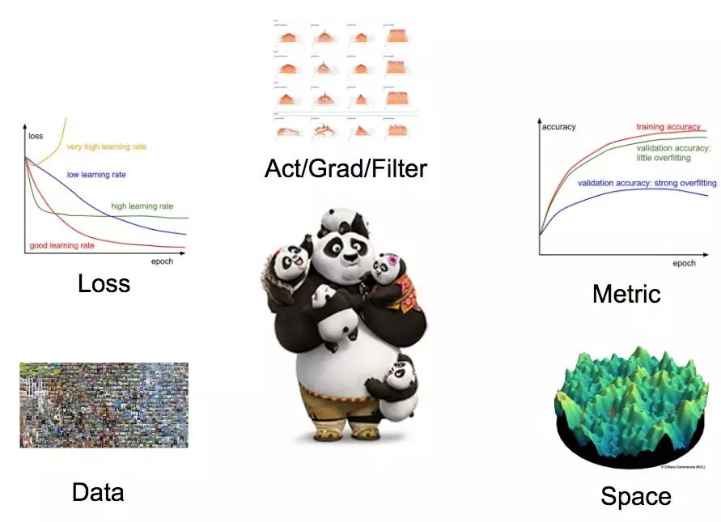
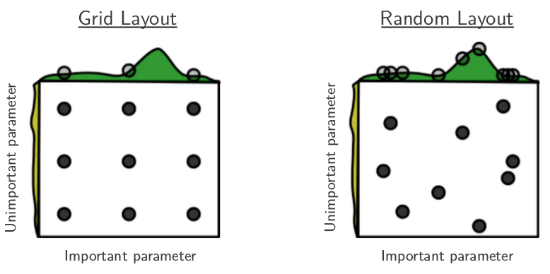
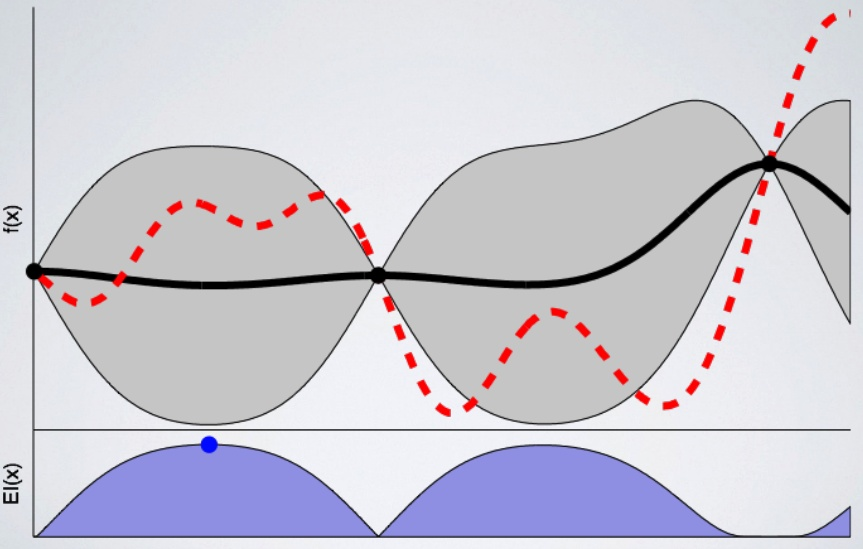
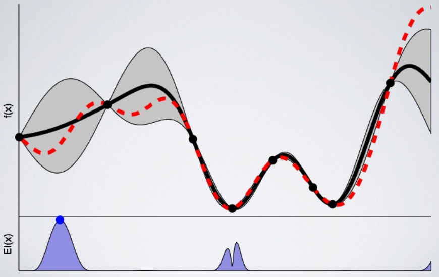

# 　　　　　　深度学习调参常用方法总结
## 引言

在深度学习工程师的日常工作中，很大一部分时间都是在训练模型，或者说调参。深度学习中的超参数很多，学习率，正则系数，dropout，weight decay，kernel size这些都是需要在训练之前设置的超参。而且每次模型训练，都要花很多时间，很多资源成本。是故，本文总结了常用的几种调参策略。

**欢迎探讨，本文持续维护。**

## 实验平台

N/A

## 试错法（Baby Sitting）

试错法也叫照看法，是最简单的调参策略。就是设计一组超参数，然后跑训练，看训练的结果满意不？不满意，就看哪里出问题了，梳理数据，查看Loss，看特征图等等，**不断根据前面的结果迭代**修改超参数，继续下一次训练，如此往复，直到满意，或者项目Deadline逼近。试错法简单易懂，技术门槛低，容易实现，是很多机器学习从业者的首选，不过缺点在于试错法最终得到的结果是**高度依赖调参者水平和经验**的一种方法（强行抹黑，哈哈）。

## 网格搜索（Grid Search）

网格搜索，稍微比试错法效率好一点。因为方法简单，**适用于超参数种类比较少，取值也不多的情况下**，也会被很多工程师用到。

基本思路是这样的，比如现在要寻找一组Dropout rate和Learning rate的最佳组合，让验证集误差最小。网格搜索就是指定一些离散的Dropout rate，比如(0.4,0.5,0.6,0.7)这四个取值；然后再给Learning rate也同样指定一些可能的取值，比如(1e-4,1e-3,1e-2)这三个取值，如果以Dropout rate为横轴，以Learning rate为纵轴建立一个平面直角坐标系，那么这些取值点就是盘面上的4x3=12个点，这些点连成一个网格。下一步就是以这12个点为参数训练12个模型，取效果最好的参数。

这个方法的优点在于容易理解，概念简单，易于多机并行化，缺点在于穷举方法太暴力，**成本太高**，特别是需要调节的参数数量比较多的时候，训练次数是成**指数性增长**的。

## 二分搜索（Binary Search）

网格搜索太暴力，成本太高。其实我们对所要调节的参数要干什么，会对最终结果（验证集误差）会产生什么影响应该是略有知晓的。网格搜索没有利用这个信息。

那如何改进呢？

如果某个参数的取值，对验证集误差来说是平滑而且有一个极值的，那么我们可以用二分搜索来减少训练次数，加快调参。

举个例子，在MTCNN人脸检测中，用的人脸分类损失是二分类交叉熵，人脸框回归和特征点定位用的是L2损失。在训练每个子网络(P-Net,R-Net和O-Net)的时候会对交叉熵和L2损失用不同的加权求和作为各自网络训练时的损失函数。以P-Net来说，L_pnet = L_cls + alpha x (L_boxreg + L_landmark)，alpha这个权重系数，就是一个可以手动调节的超参数。alpha调节的是训练时分类损失和其他两个损失的权重对比，如果alpha取值比较大，那么人脸检测任务可能表现的不好，反之alpha取值太小，框回归和特征点定位任务可能表现不好。在设定了一个最低的人脸召回率后，我们可以用二分法在(0.0,1.0)这个区间去用二分法寻找最合适的alpha值，比网格搜索要高效地多。

二分法比网格搜索效率成**指数性**的提高，但是需要超参数的取值对验证集误差是一个**凸函数**，这在仅一类超参数调节的时候还好，在多类超参数需调节的时候，一般很难保证找到全局最优。

## 随机搜索（Random Search）

二分搜索前提条件太苛刻，网格搜索效率太低，而且不适合于同时优化太多超参数。而随机搜索前提条件比较松，而且适合于同事优化多个超参数，编程也不复杂，在同样的训练次数约束下效果一般也不比网格搜索差，是一种比较重要的调参思路。

随机搜索的思路是这样的：一般我们需要调整的超参数很多，但是**并不是所有的超参数都有同样的重要性**（这一前提很重要，也很容易满足），在训练次数一定（资源约束）的情况下，**训练更多的参数的组合**（而不是像网格搜索一样，很多参数的组合都是一个参数**不动**，动其余的参数），更有可能找到那些重要的参数的最佳值（采样点更多选最优嘛）。随机搜索和网格搜索比较示意图如下：

图中需要优化（最大化）的函数是f(x,y) = g(x) + h(y)，这里x,y可以看成是超参数，f(x,y)是验证集上的损失。图上黄色的是h(y)的函数曲线，绿色是g(x)是的函数曲线。这里h(y)函数值比较均匀，在最优值处贡献比g(x)小，所以自然在x轴上采样更多的点去训练比较比较好。而左边网格搜索，9个点（9次实验）只有3种不同的x取值；右边随机搜索，里面的点都是随机找（比如在x和y上按照均匀分布找）的，同样9个点，可以找到9个不同的x值的配置来训练，**没有浪费的实验**，明显比网格搜索的3个点更容易找到g(x)的最大值，也就是找到了f(x,y)的最大值。当有几个超参数都性能没有显著影响时，随机搜索比网格搜索**指数级的高效**。另外，随机搜索不用离散化超参数的值，**有更大的搜索空间**，而不产生额外的代价而更容易搜索到超参的最佳值，这也是随机搜索比网格搜索优秀的地方。

## 贝叶斯优化（Bayesian Optimization）

上面的网格搜索和随机搜索，都有一个共同的缺点，“每一次的训练都独立于之前的训练”。相比之下，试错法和二分搜索，都会根据上一次的训练结果来做分析，根据分析结果指导下一次训练超参数的设置。

贝叶斯超参数优化方法则是有别于照看法和二分法的另一种更精巧的**可以根据前面的训练结果，来指导后面训练超参数设置**的超参数优化方法。

超参数搜索其实可以转化为一个优化问题，L = f(x)，其中x是超参数的取值，f是从这组超参数到训练出来的模型在验证集误差的映射。在及其简化的条件下，可以计算验证集上可导误差函数关于超参数的梯度来求最佳超参数，但更多的时候这个导数是找不到的。贝叶斯优化不求找到这个导数，它使用一个代理模型（例如高斯过程），这个代理模型**不仅将预测转化为一个值，还为我们提供在其它地方不确定性的范围（均值和方差）**，然后下一次选择的超参数就在**不确定性最大的**地方选择，因为选择不确定性最大的地方的超参数，可以提供**最大量的信息**。

下面以一个超参数的贝叶斯优化来举例：

上图中红色点线是验证集误差的真值，黑色曲线是我们对真值预测的平均值，灰色代表预测的不确定性，黑点是我们已经跑过的实验，不确定性为0，肯定和误差的真值一样，但离黑点远的地方，我们拥有的信息少，不确定性大。而底下蓝色的是不确定性，蓝色的点是指示下一次超参数应该选择的地方（就是不确定性最大的地方）。下图是根据上图的指示的点进行的一次迭代：

迭代之后，可以看到，多了一个黑点，我们知道了更多的关于f的信息，并更新了不确定性的分布。再在下一次挑选超参数的时候，依然选择不确定性最大的地方的超参数值来训练，如此往复，直到预先设定的标准满足或者资源耗尽。

下图是如此往复实验8个超参数的结果：

贝叶斯方法关键涉及到一个代理模型的选择，例如上图中的EI(x)的定义，现在**还没有很成熟可靠**的方法。有时候贝叶斯方法表现的像人类专家，在某些问题上可以取得比较好的结果，但有时候在某些问题上又像白痴一样。

不过如果这个方法能够有一天成熟起来，必将贡献于整个机器学习领域，节约大量的调参时间，让机器学习算法从业者把更宝贵的时间专注于考虑更本质的问题。

## 总结

本文总结了常用的几种深度学习调参的方法，这些方法都有各自的优缺点，有的方法之间还有相互借鉴的交集，需要在实际工作中多揣摩，多实验，多分析。

## 参考资料

+ [深度学习超参数搜索实用指南](https://zhuanlan.zhihu.com/p/46278815)
+ [超参数搜索不够高效？这几大策略了解一下](https://zhuanlan.zhihu.com/p/46718023)
+ [Practical guide to hyperparameters search for deep learning models](https://blog.floydhub.com/guide-to-hyperparameters-search-for-deep-learning-models/)
+ [How To Make Deep Learning Models That Don’t Suck](https://blog.nanonets.com/hyperparameter-optimization/)
+ [Random Search for Hyper-Parameter Optimization](http://www.jmlr.org/papers/volume13/bergstra12a/bergstra12a.pdf)
+ [《深度学习》](https://book.douban.com/subject/27087503/)
