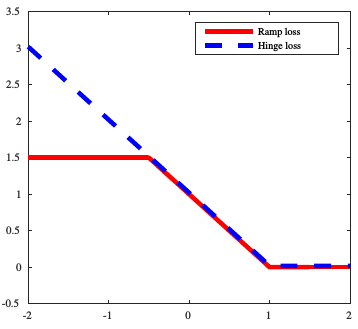
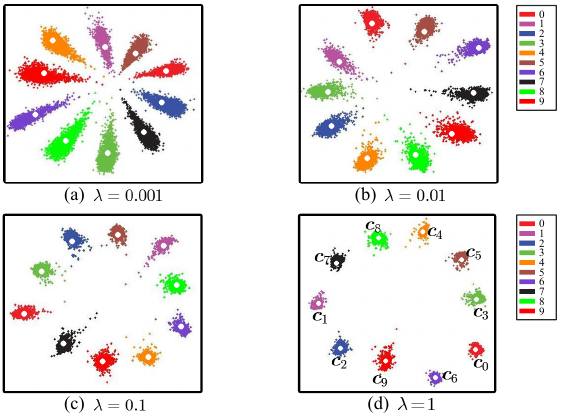
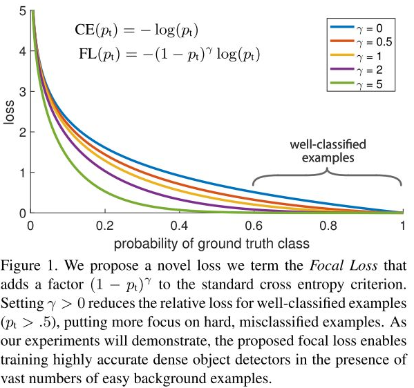
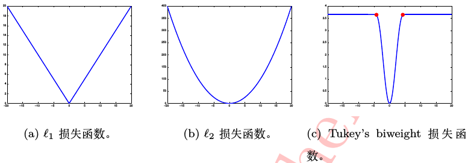

# 　　　　　　深度学习常用损失函数
## 引言

深度学习的任务本质上来说是拟合一个函数Fcnn，将输入的图片映射到对应的标签，这个映射的好坏需要用损失函数来表达，学习训练的过程也是由损失函数来指导。本文总结了一些在深度学习，更具体地说，实在卷积神经网络中常见的损失函数及其特性和使用场合。

**请注意：本文为了讨论方便，不严格区分目标函数，损失函数。**

**欢迎探讨，本文持续维护。**

## 实验平台

N/A

卷积神经网络常见的任务有两种，一种是分类（输出离散值，例如预测输入图片的类别），一种是回归（输出连续值，例如预测回归框的相对偏移量）。这两种任务都有各自适合的损失函数，**有时候是多种损失函数的组合**。这里为了方便，就以任务的不同来分别讨论各自的损失函数。

## 分类问题常用损失函数

### 交叉熵

一般来说，分类网络最后一层是用Softmax来输出预测各类别的概率值，KL散度是评价两个概率值的常见手段，交叉熵损失就是脱胎于KL散度，用来评价Softmax输出的概率分布与训练样本真值概率之间的差异性。而且，在优化的角度来讲，交叉熵损失也适合Softmax。关于交叉熵损失更详细的理解和说明，可以参见我前面写的[《为什么选交叉熵作为分类问题的损失函数》](https://github.com/Captain1986/CaptainBlackboard/blob/master/D%230012-%E4%B8%BA%E4%BB%80%E4%B9%88%E9%80%89%E4%BA%A4%E5%8F%89%E7%86%B5%E4%BD%9C%E4%B8%BA%E5%88%86%E7%B1%BB%E9%97%AE%E9%A2%98%E7%9A%84%E6%8D%9F%E5%A4%B1%E5%87%BD%E6%95%B0/D%230012.md)。

### 合页损失函数

合页损失函数L = max(0, 1-x)，其函数曲线如下图蓝色线所示，类似于一个合页而得名。合页损失函数起源于SVM，它的特点是对错分类的点，考虑到它距离分类平面的远近，距离越大则损失越大；但是对于能正确分类的样本，如果这些样本离分类平面的距离不够大的话，也会有一点损失。这样就强迫了在优化的时候，优化过程去寻找最大间隔划分平面。关于它的讨论，可以参见我前面写的[《支持向量机》](https://github.com/Captain1986/CaptainBlackboard/blob/master/D%230009-SVM/D%230009.md)一文。

### 坡道损失函数

合页损失函数对于错误越大的样本，施加的惩罚越严重。可是样本毕竟不是那么完美的，如果里面有一些**标签错误的**，或者本身就是**离群点（outlier）**，那么就会误导合页损失，从而影响分类超平面的学习。

为了缓解这个问题，坡道损失函数（其函数图像如上图红色曲线），限制了损失的最大值，在一定程度上缓解了前面讨论的错误标签和离群点带来的问题。

### 中心损失函数

上面介绍的损失函数，仅仅只考虑了学到让不同类与类之间间隔增大的特征；而**良好的特征，不仅仅要考虑不到不同类之间间隔要大，应该也要保证同类之间的间隔要小，这样的特征更有辨别力**。中心损失函数，就可以指导网络学习到的特征，在同类的时候尽量聚拢在一起。

上式为中心损失函数的表达式，其中c_yi为第yi类训练样本深度特征的均值点。网络学习到特征离离中心点越远，则惩罚越大，这就促使网络去学让每个同类别样本能聚拢在一块的特征。

在实际使用中，由于中心点损失函数值考虑类内差异性，而交叉熵损失函数只考虑类间差异性，一般会把中心损失函数和交叉熵损失函数配合起来用各取所长。这样网络最终的目标函数可以表示为：

其中，lamda代表了两种损失的相对比例，用来调节学习到的特征类间分离性和类内聚拢性之间的相对强度，lamda越大，类内聚拢越强烈。

如上图所示，为做0~9这十个手写数字分类任务时，用L_final目标函数优化网络，取不同lamda值所学习到的特征投影到二维平面的图像。可以明显地观察到，当中心损失函数比重增大时，网络学习到的特征更集中，类间差异更小，学习到的特征更好。

在分类性能方面，**中心损失函数搭配传统交叉熵损失函数作为目标函数学习到的特征要优于只使用传统交叉熵损失函数作为目标函数所学习到的特征**，特别是在人脸识别问题上可能有较大的性能提升。

### Focal Loss

Focal Loss首次提出于2017年ICCV最佳学生论文奖《Focal Loss for Dense Object Detection》，主要是为了解决在目标检测这个问题中，训练样本负样本和正样本不平衡的问题。训练样本不平衡会带来：

1. 大量容易负样本（不提供有用的学习信息）会导致训练过程无效。

2. 大量容易负样本产生的loss会压倒少量正样本的loss（即容易负样本的梯度占主导），导致模型性能衰退。

Focal Loss表达式，其中，p代表网络预测得到的标签为1的概率（此处以二分类问题为例），**p_t是网络分对了的概率**，y是真值的标签，取值正负1，gamma值为可以调节的聚焦参数，(1 - p_t)^gamma为调制因子。

gamma聚焦参数对Focal Loss的影响如上图。可以看到：

1. 当网络正确分类的时候(上图中是p_t > 0.6)，大多都是负样本这样的容易样本，损失很小；当网络分类错误的时候，损失很大；

2. 调制因子gamma可以调节对错误分类损失的**相对放大程度**，当gamma越大的时候，越是关注与那些难分错分的样本，让他们的损失大一点，引导网络学习。

3. 当gamma = 0的时候，Focal Loss退化成交叉熵。

直观的来看，调制因子gamma增大，会减少容易样本的loss，并且扩大得到低loss值的样本范围从而增加错误分类样本的重要性。

实际使用时，使用的是α-balanced变体的Focal Loss，让alpha参数调节对正样本和负样本的关注程度（一般更关注于数量更少的正样本），gamma参数调节容易样本带来的相对损失（让容易样本带来的相对损失小）。

## 回归问题常用损失函数

### L1 Loss

L1损失如上图最左边所示，它常作为正则项来减轻模型过拟合或者使网络稀疏化（可参看[《拉格朗日乘子法》](https://github.com/Captain1986/CaptainBlackboard/blob/master/D%230008-%E6%8B%89%E6%A0%BC%E6%9C%97%E6%97%A5%E4%B9%98%E5%AD%90%E6%B3%95/D%230008.md)一文介绍），做特征选择，模型压缩用。

L1损失直接对网络输出的预测值和真值的差值取绝对值，计算简单，原理直观。

### L2 Loss

L2损失如上图中间所示，它经常作为正则项来减轻模型的过拟合。在回归问题中，L2相对于L1来说，同样幅度的误差带来的损失更大，而且它的导数在网络训练的后期更小，所以在某些情况下，其能达到的精度也要高于L1损失；另外，因为L2的导数大于L1的导数（在误差大于1的情况下），所以，在训练时，用L2作为损失函数，其收敛速度也快于L1。

### Tukey's biweight

Tukey's biweight损失函数和坡道损失函数一样，是一种克服噪声和离群点的鲁棒损失函数。其定义为，函数图像如上图最右边所示，常数c指定了函数图像拐点的位置，**一般指定为4.6851**，此时Tukey's biweight可取得与L2损失函数在最小化符合正态分布的参差类似的（95%渐进）的回归效果。

### Smooth-L1 Loss

Smooth L1损失首次是在Fast RCNN算法里面作为Bounding Box Regression的损失函数提出，它是L1损失的改良版本，和普通L1损失和L2损失相比，有如下三点优势:

1. **第一，它在训练的后期**，当预测值与真值相差很小的时候，Smooth L1的导数比L1的导数更小，可以**使训练达到更高的精度**。

2. **第二，在训练的前期**，当预测值和真值相差很大的时候，Smooth L1的导数相比于L2的导数不会太大，**避免了训练不稳定**的情况出现。

3. **第三，对于数据噪音和离群点**，Smooth L1的损失比L2的损失小，不容易误导网络训练。换句话说就是，对噪音和离群点更鲁棒。

基于以上优点，在Fast RCNN之后，很多流行的目标检测算法，比如Faster RCNN和SSD，也都采用了Smooth L1这种损失。

## 总结

本文以深度学习的分类问题和回归问题介绍了常见的几种损失函数，其中这些损失函数有的可以互用（比如L2损失函数也经常用在分类问题上）。损失函数的构造或者选择，需要根据具体要解决的问题来，总的思路是，引导网络学习到辨别力强（类间距离大，类内距离小）的特征，而且还要容易优化。

## 参考资料

+ [《深度学习》](https://book.douban.com/subject/27087503/)
+ [CNN_book](http://210.28.132.67/weixs/book/CNN_book.pdf)
+ [Soft Sampling：探索更有效的采样策略](https://zhuanlan.zhihu.com/p/63954517)
