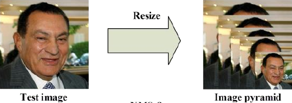
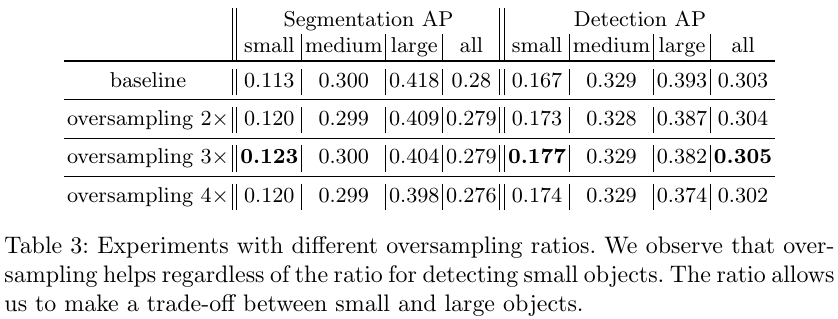
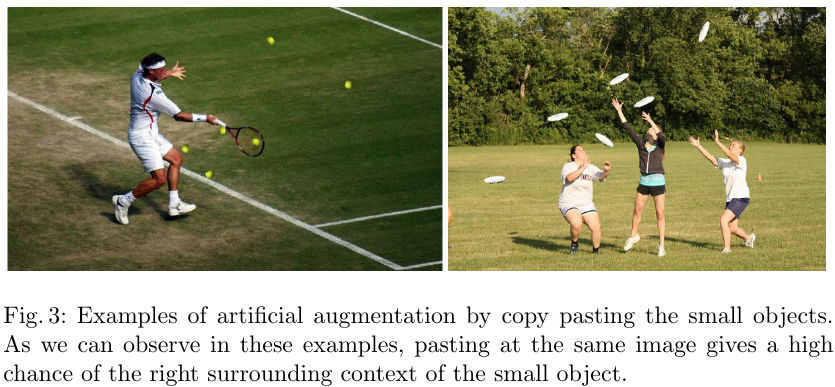
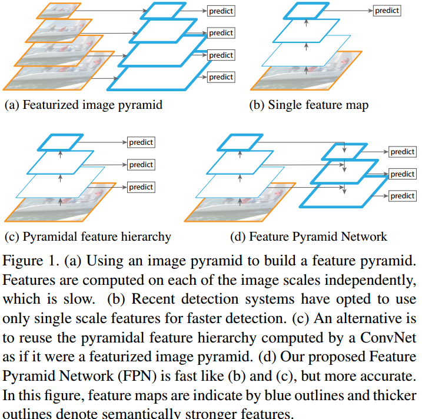
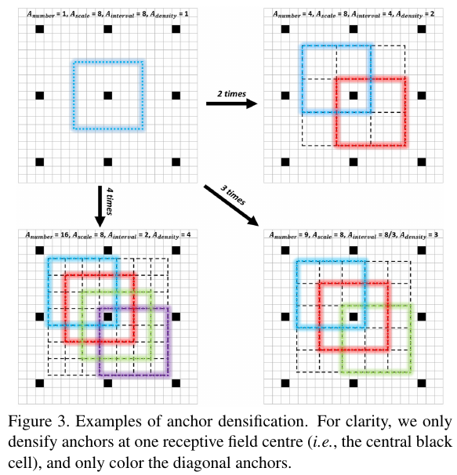
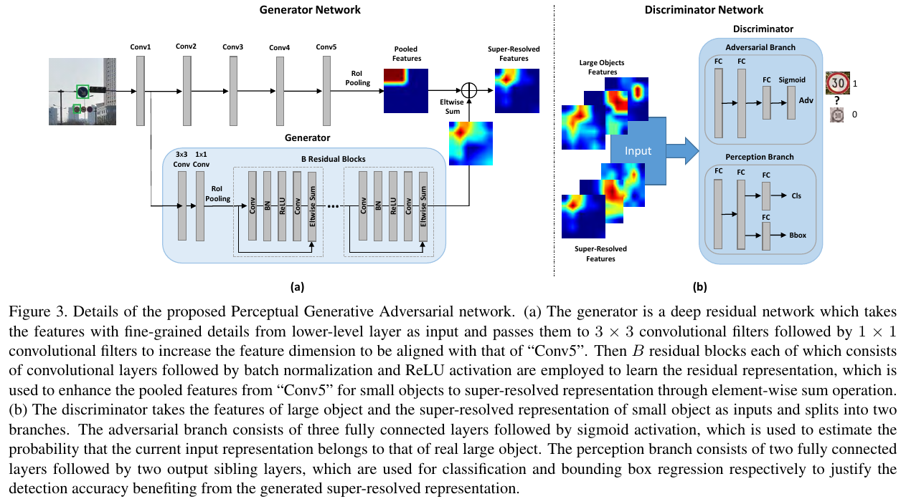
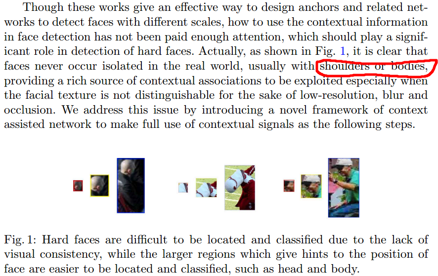
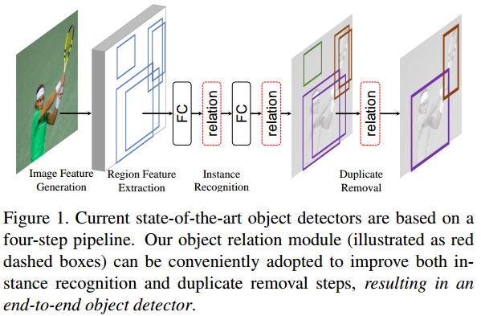

# 　　　　　　　                   深度学习检测小目标常用方法
## 引言

在深度学习目标检测中，特别是人脸检测中，小目标、小人脸的检测由于**分辨率低，图片模糊，信息少，噪音多**，所以一直是一个实际且常见的困难问题。不过在这几年的发展中，也涌现了一些提高小目标检测性能的解决手段，本文对这些手段做一个分析、整理和总结。

**欢迎探讨，本文持续维护。**

## 实验平台

N/A

## 传统的图像金字塔和多尺度滑动窗口检测

最开始在深度学习方法流行之前，对于不同尺度的目标，大家普遍使用将原图build出**不同分辨率的图像金字塔**，再对每层金字塔用固定输入分辨率的分类器在该层滑动来检测目标，以求在金字塔底部检测出小目标；或者只用一个原图，在原图上，用**不同分辨率的分类器**来检测目标，以求在比较小的窗口分类器中检测到小目标。

在著名的人脸检测器[MTCNN](https://arxiv.org/abs/1604.02878)中，就使用了图像金字塔的方法来检测不同分辨率的人脸目标。

不过这种方式速度慢（虽然通常build图像金字塔可以使用卷积核分离加速或者直接简单粗暴地resize，但是还是需要做多次的特征提取呀），后面有人借鉴它的思想搞出了特征金字塔网络FPN，它在不同层取特征进行融合，只需要一次前向计算，不需要缩放图片，也在小目标检测中得到了应用，在本文后面会讲到。

## 简单粗暴又可靠的Data Augmentation

深度学习的效果在某种意义上是靠大量数据喂出来的，小目标检测的性能同样也可以通过增加训练集中小目标样本的种类和数量来提升。在[《深度学习中不平衡样本的处理》](https://github.com/Captain1986/CaptainBlackboard/blob/master/D%230016-%E6%B7%B1%E5%BA%A6%E5%AD%A6%E4%B9%A0%E4%B8%AD%E4%B8%8D%E5%B9%B3%E8%A1%A1%E6%A0%B7%E6%9C%AC%E7%9A%84%E5%A4%84%E7%90%86/D%230016.md)一文中已经介绍了许多数据增强的方案，这些方案虽然主要是解决不同类别样本之间数量不均衡的问题的，但是有时候小目标检测之难其中也有数据集中小样本相对于大样本来说数量很少的因素，所以其中很多方案都可以用在小样本数据的增强上，这里不赘述。另外，在19年的论文[Augmentation for small object detection](https://arxiv.org/pdf/1902.07296.pdf)中，也提出了两个简单粗暴的方法：

1. 针对COCO数据集中包含小目标的图片数量少的问题，使用过采样OverSampling策略；

2. 针对同一张图片里面包含小目标数量少的问题，在图片内用分割的Mask抠出小目标图片再使用复制粘贴的方法（当然，也加上了一些旋转和缩放，另外要注意不要遮挡到别的目标）。

   

在同一张图中有更多的小目标，在Anchor策略的方法中就会匹配出更多的正样本。

## 特征融合的FPN

不同阶段的特征图对应的感受野不同，它们表达的信息抽象程度也不一样。**浅层的特征图感受野小，比较适合检测小目标（要检测大目标，则其只“看”到了大目标的一部分，有效信息不够）；深层的特征图感受野大，适合检测大目标（要检测小目标，则其”看“到了太多的背景噪音，冗余噪音太多）**。所以，有人就提出了将不同阶段的特征图，都融合起来，来提升目标检测的性能，这就是特征金字塔网络[FPN](https://arxiv.org/abs/1612.03144)。

在人脸领域，基本上性能好一点的方法都是用了FPN的思想，其中比较有代表性的有[RetinaFace: Single-stage Dense Face Localisation in the Wild](https://arxiv.org/pdf/1905.00641.pdf)

## 合适的训练方法SNIP(放大图像)以及SNIPER和SAN

## 更稠密的Anchor采样和匹配策略S3FD,FaceBoxes

在前面Data Augmentation部分已经讲了，复制小目标到一张图的多个地方可以增加小目标匹配的Anchor框的个数，增加小目标的训练权重，减少网络对大目标的bias。同样，反过来想，如果在数据集已经确定的情况下，我们也可以增加负责小目标的Anchor的设置策略来让训练时对小目标的学习更加充分。例如人脸检测中的[FaceBoxes](https://arxiv.org/abs/1708.05234)其中一个Contribution就是Anchor densification strategy，Inception3的anchors有三个scales(32,64,128)，而32 scales是稀疏的，所以需要密集化4倍，而64 scales则需要密集化2倍。在[S3FD](http://openaccess.thecvf.com/content_ICCV_2017/papers/Zhang_S3FD_Single_Shot_ICCV_2017_paper.pdf)人脸检测方法中，则用了Equal-proportion interval principle来保证不同大小的Anchor在图中的密度大致相等，这样大脸和小脸匹配到的Anchor的数量也大致相等了。

另外，对小目标的Anchor使用比较宽松的匹配策略（比如IoU > 0.4）也是一个比较常用的手段。

## 先生成放大特征再检测的GAN

[Perceptual GAN]()使用了GAN对小目标生成一个和大目标很相似的Super-resolved Feature（如下图所示），然后把这个Super-resolved Feature叠加在原来的小目标的特征图（如下下图所示）上，以此增强对小目标特征表达来提升小目标（在论文中是指交通灯）的检测性能。

## 利用Context信息的Relation Network和PyramidBox

小目标，特别是像人脸这样的目标，不会单独地出现在图片中（想想单独一个脸出现在图片中，而没有头、肩膀和身体也是很恐怖的）。像[PyramidBox](https://arxiv.org/abs/1803.07737)方法，加上一些头、肩膀这样的上下文Context信息，那么目标就相当于变大了一些，上下文信息加上检测也就更容易了。

这里顺便再提一下通用目标检测中另外一种加入Context信息的思路，[Relation Networks](https://arxiv.org/abs/1711.11575)虽然主要是解决提升识别性能和过滤重复检测而不是专门针对小目标检测的，但是也和上面的PyramidBox思想很像的。

## 总结

## 参考资料

+ [Joint Face Detection and Alignment using Multi-task Cascaded Convolutional Networks](https://arxiv.org/abs/1604.02878)

+ [《深度学习中不平衡样本的处理》](https://github.com/Captain1986/CaptainBlackboard/blob/master/D%230016-%E6%B7%B1%E5%BA%A6%E5%AD%A6%E4%B9%A0%E4%B8%AD%E4%B8%8D%E5%B9%B3%E8%A1%A1%E6%A0%B7%E6%9C%AC%E7%9A%84%E5%A4%84%E7%90%86/D%230016.md)

+ [Augmentation for small object detection](https://arxiv.org/pdf/1902.07296.pdf)

+ [Feature Pyramid Networks for Object Detection](https://arxiv.org/abs/1612.03144)

+ [RetinaFace: Single-stage Dense Face Localisation in the Wild](https://arxiv.org/pdf/1905.00641.pdf)

+ [An Analysis of Scale Invariance in Object Detection - SNIP](https://arxiv.org/abs/1711.08189)

+ [SNIPER: Efficient Multi-Scale Training](https://arxiv.org/pdf/1805.09300.pdf)

+ [SAN: Learning Relationship between Convolutional Features for Multi-Scale Object Detection](https://arxiv.org/pdf/1808.04974.pdf)

+ [ScratchDet: Training Single-Shot Object Detectors from Scratch](https://arxiv.org/pdf/1810.08425.pdf)

+ [FaceBoxes: A CPU Real-time Face Detector with High Accuracy](https://arxiv.org/abs/1708.05234)

+ [S3FD: Single Shot Scale-Invariant Face Detector](http://openaccess.thecvf.com/content_ICCV_2017/papers/Zhang_S3FD_Single_Shot_ICCV_2017_paper.pdf)

+ [Perceptual Generative Adversarial Networks for Small Object Detection](https://arxiv.org/abs/1706.05274)

+ [PyramidBox: A Context-assisted Single Shot Face Detector](https://arxiv.org/abs/1803.07737)

+ [Relation Networks for Object Detection](https://arxiv.org/abs/1711.11575)
