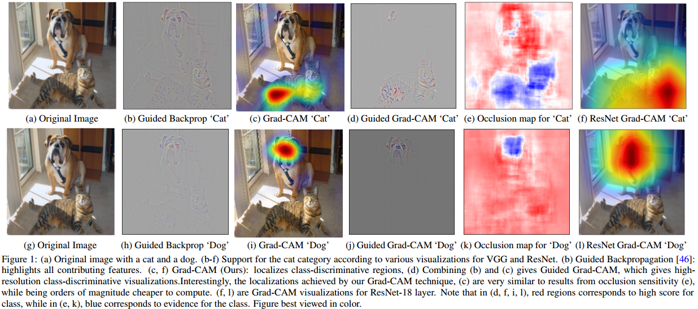
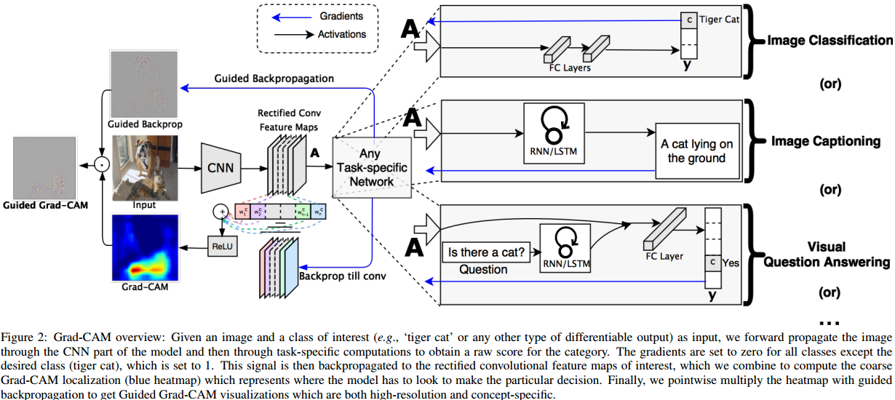
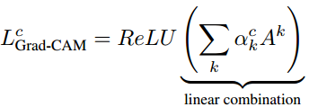

# 　　　　　　　                 CNN可视化之类激活热力图CAM
## 引言

卷积神经网络因为其在很多任务上效果很好但是其学到的内容和规则很难用人类理解的方式来呈现（相对于传统机器学习算法，例如决策树或者逻辑回归等），所以被很多人认为是“黑盒”。如果我们可以可视化

1. 网络模型里面的**中间层的激活**结果；
2. 或者网络学到的**过滤器**是提取什么类型特征的；
3. 或者是图像中哪些位置的像素对输出有着强烈的影响，换句话说，**输出对哪些位置的像素值比较敏感**。

那么无疑对我们理解模型，或者分析模型为什么犯错有着很实际的用处。

所幸的是，2013年以来，随着深度学习的发展，也有一些很好的论文研究深度学习中模型可视化这一领域并取得了一些成果。例如，2014年ECCV上Zeiler的《Visualizing and Understanding Convolutional Networks》研究了第一个问题，此文也是可视化这一领域的开山之作；2012年NIPS上Alex Krizhevsky发表的AlexNet应该是最早可视化过滤器的文章；而针对第三个问题，2016年的**CAM** 《Learning deep features for discriminative localization》，2017年的**Grad-CAM** 《Grad-CAM:Visual Explanations from Deep Networks via Gradient-based Localization》和紧接着2018年的**Grad-CAM++** 《Grad-CAM++: Generalized Gradient-based Visual Explanations for Deep Convolutional Networks》这一系列的文章都对**类激活图**(**C**lass **A**ctivation **M**ap)这种可视化技术做了比较充分的研究。

本文结合论文和有关资料，详细描述一些Grad-CAM这种可视化的方法，它除了原理简单，效果好之外，还有个很大的优点就是**不需要重新训练模型也不需要改造模型结构**。

**欢迎探讨，本文持续维护。**

## 实验平台

N/A

## Grad CAM的基本思路推导

### 先说什么是CAM

CAM是**C**lass **A**ctivation **M**ap类激活热力图的意思，比如说，一个分类网络AlexNet，输入一个既包含着一只狗，又包含着一只猫的猫狗合影图片，它会输出一个1000维度的概率向量，其中有两个分量分别对应着图片分类为猫和图片分类为狗的概率。那么这两个概率，与图片中的哪些部分的关系更大，那些部分的关系更小呢？换句话讲，输出的概率的大小与输入图片中哪些区域的像素值更**敏感**呢？如果找出这个敏感度的一个热力图，越敏感的地方，温度越高，越不敏感的地方，温度月底，那就是类激活热力图，如下图中c和i所示就分别时预测猫类别的CAM和预测狗类别的CAM，它很直观地告诉了我们模型是“看到了”猫的身体所以才认为图中有猫，“看到了”狗的脸才认为图中有狗。

### 再说怎么计算CAM

如上图所示，计算CAM的过程很简单，这里以计算上上图中猫类的CAM为例说明：

首先，计算最后一层Softmax输出中猫类概率yc对最后一层特征图所有像素Aij的偏导数，即，其中y是Softmax输出的概率向量，c是猫那一类的序号，A是最后一层卷积层输出的特征图，k是特征图的通道维度的序号，i和j分别时宽高维度的序号。

然后，把yc对特征图每个像素的偏导数求出来之后，取一次宽高维度上的全局平均。这一步得到的akc就是c类相对于最后一层卷积层输出的特征图的第k个通道的敏感程度。

第三步，把这个akc当作权重将最后一层特征图加权，线性组合起来。

第四步，把这个组合起来的值（其实是个二维map），送入ReLU激活函数处理一下输出。第三步和第四步写在一起就是。

这个L是一个二维map，它就是我们要的类别激活热力图。

这里有几个需要说明的地方，

1. 原始论文《Grad-CAM:Visual Explanations from Deep Networks via Gradient-based Localization》中说yc应该是“the score for class c”，“before the softmax”，但是一些实现代码里面，直接用的是Softmax层的输出，我觉得也是可以的，这里是忠于了文章的思想但是没有完全终于原文（私以为原文是为了让它的Grad-CAM方法适用于更多的问题领域），尽信书不如无书；
2. 计算akc时用到的global average pooling这个方法比较粗糙，在后面2018年出来的Grad-CAM++论文中有进一步的细化和推广；
3. 为什么第四步里面要加一个ReLU？因为我们需要得到的是和c类概率得分**正相关**的热力图，如果特征图A上某个位置通过a加权得到的值为负数，那么它更可能属于不是c类的别的类。
4. 因为最后一层特征图的分辨率不一定和输入图片一致，为了得到和输入图片一样大小的热力图，最后还有个resize操作，不要忘记了。

## Grad CAM的代码实现过程

。

## 总结

。

## 参考资料

+ [Visualizing and Understanding Convolutional Networks](https://arxiv.org/abs/1311.2901)
+ [Understanding Neural Networks Through Deep Visualization](https://arxiv.org/abs/1506.06579)
+ [Learning deep features for discriminative localization](https://arxiv.org/pdf/1512.04150.pdf)
+ [Grad-CAM:Visual Explanations from Deep Networks via Gradient-based Localization](https://arxiv.org/abs/1610.02391)
+ [Grad-CAM++: Generalized Gradient-based Visual Explanations for Deep Convolutional Networks](https://arxiv.org/abs/1710.11063v1)
+ [《Python深度学习》](https://book.douban.com/subject/30293801/)
